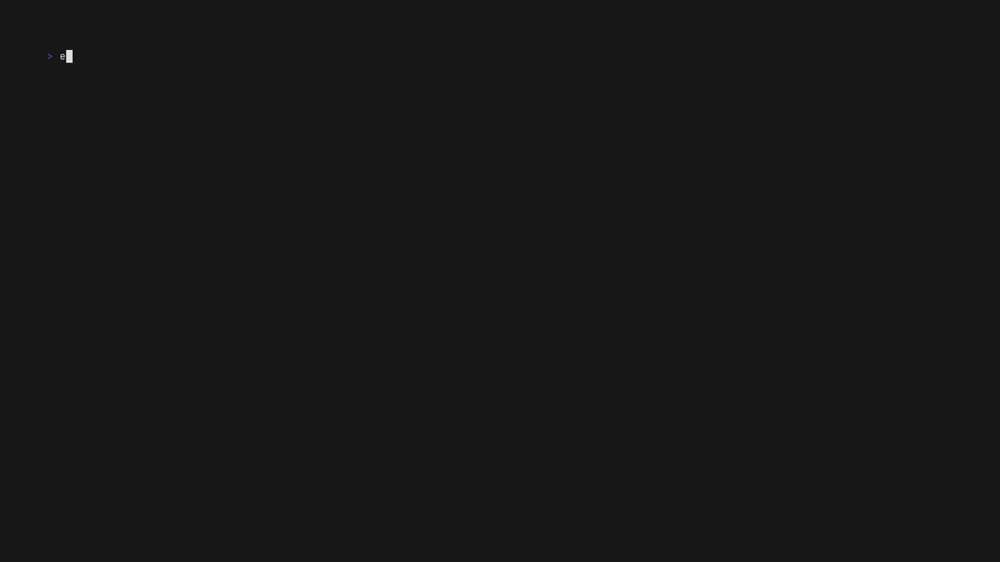

# losrs

*losrs* lets you review Spaced Repetition System (SRS) cards created in
[Logseq](https://github.com/logseq/logseq) in the terminal.

This project was created as a workaround for
[Logseq SRS Algorithm being faulty](https://github.com/logseq/logseq/issues/8890)
and the fault
[only being fixed in the database version of Logseq](https://github.com/logseq/logseq/pull/11540)
to the exclusion of plain file version of Logseq.



## Prerequisites

losrs works with a very narrow subset of Logseq features,
at the very least you need to ensure that:
Logseq graph root where you plan to use losrs is configured with
`:export/bullet-indentation :two-spaces` .

To render images in your cards you can use losrs with
`--format=(sixel|kitty|i-term)`.

All image based formats require:

* [Pandoc](https://github.com/jgm/pandoc) available on the `$PATH`
* [Typst](https://github.com/typst/typst) available on the `$PATH`

Each image protocol requires your terminal to support it.
To see which terminals support sixel visit
[Are We Sixel Yet?](https://www.arewesixelyet.com/).

For sixel you will need
`img2sixel` (via [libsixel](https://github.com/saitoha/libsixel))
available on the `$PATH`.
There is an outstanding `TODO` to not require `img2sixel`.

Rendering pipeline is basically:

```text
markdown -> typst -> png -> image-protocol
```

And was inspired by [presenterm](https://github.com/mfontanini/presenterm).
The
[reasons presenterm has for converting LaTeX to Typst](https://github.com/mfontanini/presenterm/blob/master/docs/src/features/code/latex.md?plain=1#L30)
do not apply to this project, but I found it easy to work with this pipeline
so I'm keeping it. It would be nice to remove the dependency on Typst
and to support more LaTeX, but I am unlikely to get around to changing this
any time soon.

## Limitations

Things that are known to NOT work:

* Rendering references
* Rendering LaTeX code that can not be converted to Typst
* If multiple cards with the same prompt are on the same page,
  when reviewing any of the cards
  the metadata will be updated for one of the cards,
  but not necessarily the one that was due for review.
  This is a consequence of not tracking the position of cards
  in the page, and updating code matching on prompt.
* Cards with cloze deletions do not have a three stage review
  (show prompt, show response with cloze block hidden,
  show response with cloze block shown),
  and instead have a normal two stage review
  (show prompt, show response).
* When rendering via an image based format,
  a card must fit in the terminal window by height.
  Specify a relative height like `{height=50%}` to ensure
  images fit.
